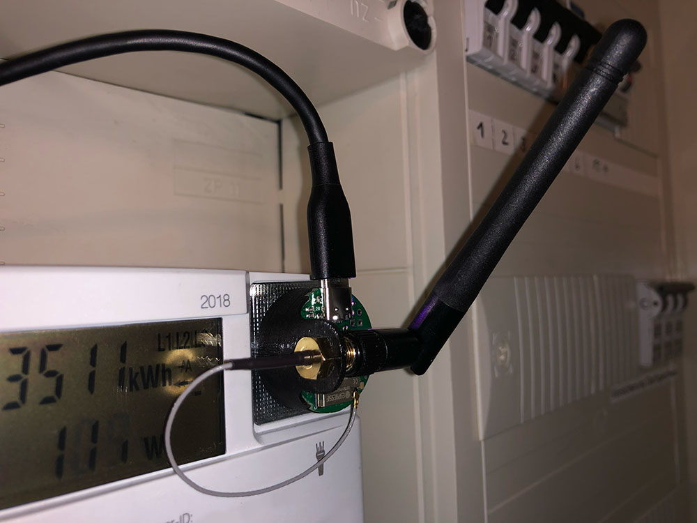

## Hardware
Features:
- IR interface for a [smart](https://youtu.be/aqHauk3bNFA) electricity meter
- binary input for gas meter

  
Detailed overview: https://a360.co/3Tq192N

## Software
For Tasmota to use the SML feature, the following must be added to the ```user_config_override.h```-File (as per [documentation](https://tasmota.github.io/docs/Smart-Meter-Interface/)):

```
#ifndef USE_SCRIPT
#define USE_SCRIPT
#endif
#ifndef USE_SML_M
#define USE_SML_M
#endif
#ifdef USE_RULES
#undef USE_RULES
#endif
```
The software is compiled using the 8M tasmota32 preset. Flashed using [this](https://github.com/FranzImsch/CP2104-M8) serial adapter.

As soon as the device is connected to WiFi, the script for the electricity meter can be entered into the console (as per [documentation](https://tasmota.github.io/docs/Smart-Meter-Interface/#iskra-mt-681-sml)). The RX (25) and TX (26) GPIOs have to be adjusted. The script might need to be adjusted for the very meter that is used. For that, [this](https://tasmota-sml-parser.azurewebsites.net/) tool was tremendously helpful.

The **gas meter** is read with a reed contact. IO27 is set as a counter in Tasmota. What 1 Tick corresponds to in terms of gas is usually written somewhere on the meter. The counter is debounced using the [```CounterDebounce 250```](https://tasmota.github.io/docs/Commands/#sensors) command (which corresponds to 250 ms debounce time).

Also, the TelePeriod was set to 10 seconds (the fastest) as per [documentation](https://tasmota.github.io/docs/Commands/#mqtt).

## Links
- [3D model](https://a360.co/3Tq192N)  
- [Schematic](https://franz.science/stromzaehler/Schematic.pdf)  
- [iBom](https://franz.science/stromzaehler/ibom/)  
- [Tasmota](https://github.com/arendst/tasmota)